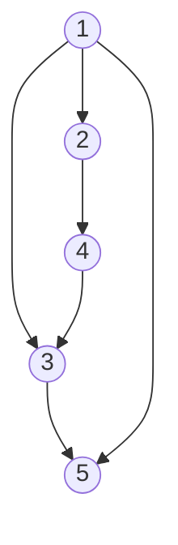

## 🔖 Background Information

Dijkstra's algorithm finds the shortest paths between nodes in a weighted graph. It was conceived by Edsger W. Dijkstra in 1956 and published three years later.

## 🎯 Problem Statement

Implement a version of Dijkstra's algorithm which takes a graph, a starting node, and an ending node as its arguments. It should return the length of the shortest path between the two nodes.

## ✅ Acceptance Criteria

Implement a function that takes the following arguments:

1. A graph of nodes, edges, and weights represented in any of the four canonical forms listed in the Dev Notes
2. A starting node
3. An ending node

It should then use Dijkstra's algorithm to calculate the shortest path between the two nodes. If no path exists between the two nodes, return -1.

## 📋 Dev Notes

* If you search the web, there are a few different ways that people implement Dijkstra's algorithm (min priority queue, Fibonnacci heap, etc.). You can implement any variation of the algorithm for this lab.
* A directed graph with no explicit weights assumes that all of the arrows have a weight of one.
* It is your choice how you want to pass the graph data to the algorithm. You can represent the graph as:
  * An edge list
  * An adjacency list
  * An adjacency map
  * An adjacency matrix
* You are allowed to use built-in data structures from the standard library of the language that you are using (i.e. hashmaps, queues, graphs, etc.). However, you are NOT allowed to use any premade search algorithm on graphs. You have to implement this code by yourself!

## 🖥️ Example Output

Consider the directed graph shown above. Some sample outputs of your algorithm would be:

| Starting Node | Ending Node | Output |
|----|----|----|
| 1 | 2 | 1 |
| 1 | 5 | 1 |
| 2 | 5 | 3 |
| 5 | 1 | -1 |
| 2 | 1 | -1 |

## 📝 Thought Provoking Questions

1. How did you represent the graph that was passed into the algorithm (i.e. edge list, adjacency list, adjacency map, or adjacency matrix)? Why did you choose this option?
2. What is the time complexity of Dijkstra's algorithm?
3. Suppose you naively tried to solve this problem with a brute force algorithm. What is its time complexity?

## 💼 Add-Ons For the Portfolio

N/A

## 🔗 Useful Links

* [Java Project Template](https://github.com/cmvandrevala/get-there-as-fast-as-possible-java-template)

## 📘 Works Cited

N/A
