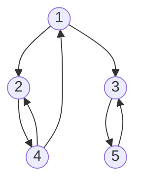

Consider the graph shown below.

1. Is this a directed or undirected graph?
2. Is this a strongly connected graph?
3. Is 5 reachable from 2? If so, what path can you follow?
4. Write out an edge list for this graph.
5. Write out an adjacency list for this graph.
6. Write out an adjacency map for this graph.
7. Write out an adjacency matrix for this graph.
8. Compute a topological ordering for this graph.
9. Write out the transitive closure for this graph.
10. What are the neighbors of node 3?
