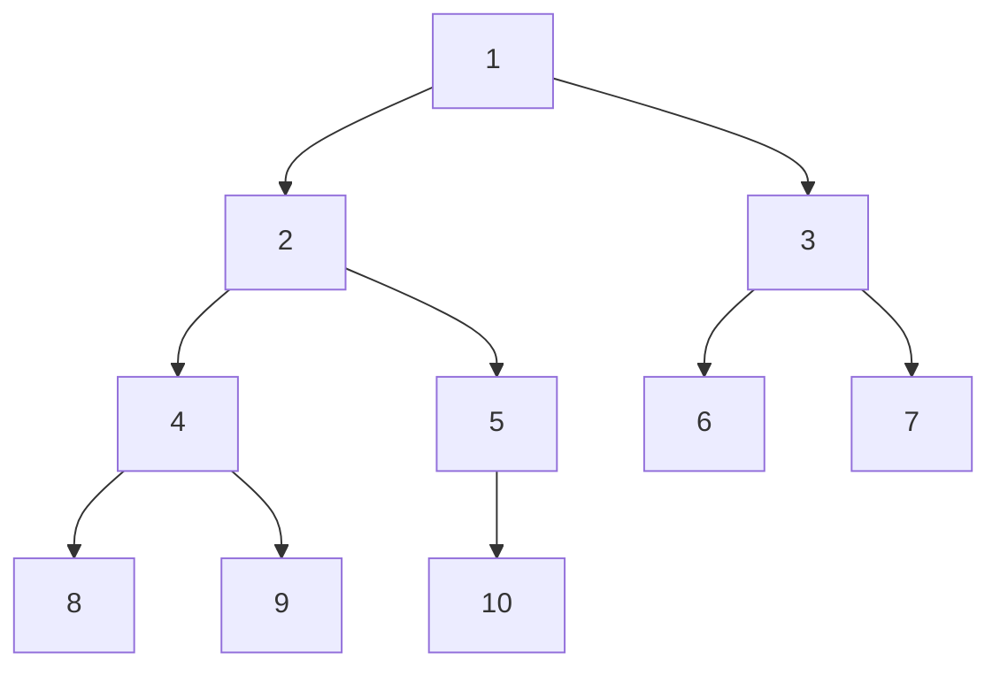

Use the binary tree shown above to answer the following questions.

1. Which node is the root node?
2. What are the internal nodes of the tree?
3. What are the descendants of node (4)?
4. What are the ancestors of node (5)?
5. What are the siblings of node (6)?
6. What is the depth of node (7)?
7. What is the left subtree of node (2)?
8. What is the right subtree of node (2)?
9. What is the height of the tree?
10. Is this a proper or improper binary tree?
11. What is the sequence of elements if you performed a depth-first, pre-order tree traversal?
12. What is the sequence of elements if you performed a depth-first, post-order tree traversal?
13. What is the sequence of elements if you performed a depth-first, in-order tree traversal?
14. What is the sequence of elements if you performed a breadth-first tree traversal?
15. What is the sequence of elements if you performed an Euler tour?

---

16. Write the pseudocode for an algorithm that calculates the total number of nodes in a binary tree.

---

17. Write the pseudocode for an algorithm that takes two binary trees as arguments and returns `true` if they are structurally identical or `false` otherwise. Structurally identical means that the trees are made of nodes with the same values arranged in the same way.
