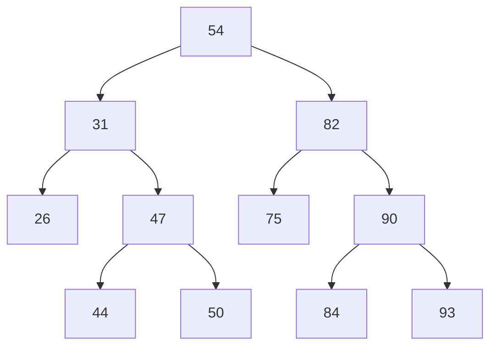

1. Suppose I want to insert the values 8, 3, 4, 9, 2, 1, 10, 7, 8, 14 into a binary search tree in that order.

* Sketch out the tree after all of the insertions have been made.
* Is the tree balanced?
* What is the output if I perform an in-order traversal of the tree?

---

2. Suppose you take the binary search tree that you sketched out in Question 1 and delete the element 3.

* Sketch out the new tree after the deletion is complete.
* How many internal nodes does the tree contain?
* What is the output if I perform an in-order traversal of the tree?

---

3. How many different shapes exist for a binary search tree made up of the elements 1, 2, and 3? Sketch them out.

---

4. Write the pseudocode for an algorithm that finds the maximum element in a binary search tree.

---

5. Consider the AVL tree shown below.

* Draw the AVL tree which results when you insert 52 into the original tree.
* Draw the AVL tree which results when you delete 82 from the original tree.
